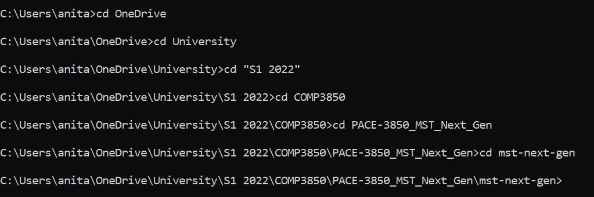

# Handover Instructions

## Dependencies

**Node.js**: Install the latest version of Node.js (the one that says Recommended For Most Users) https://nodejs.org/en/ (please note that when development started, we all utilised version 16.14.2)

## Running the website on your local system

<ol>
  <li>Clone the repository to your system (save it in a location which you will remember)</li>

  <li>Navigate to the "mst-next-gen" folder (inside the downloaded folder) in the Terminal/Command Prompt (or you can right click on the folder in your File Explorer and open it in the Terminal/Command Prompt)</li>

  
  <li>Enter the command "npm install" (this will install all of the packages needed to run the React application, and may take a bit of time)</li>
  <li>Enter the command "npm run build"</li>
  <li>Enter the command "npm run server"</li>
  <li>Enter the command "npm run initData"</li>
  <li>In your web browser (preferably Chrome), type in the address 127.0.0.1:3001 into the search bar</li>
  <li>The website should appear.</li>
</ol>

## Database
We have utilised a MongoDB database for this project. 
The database is public, and you can access it by ... (SAMMY FILL OUT)

## Other Notes
There were some features that due to time constraints, we were not able to implement. Please see the slides from our final presentation (Deliverable 6) for most information on this. 

Please also feel free to reach out to us if you have any questions about the code.

